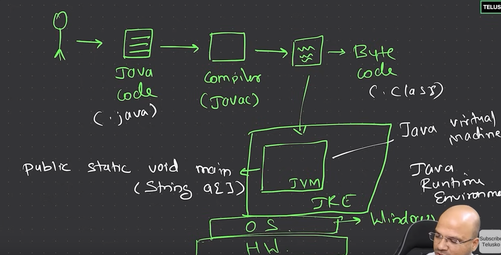
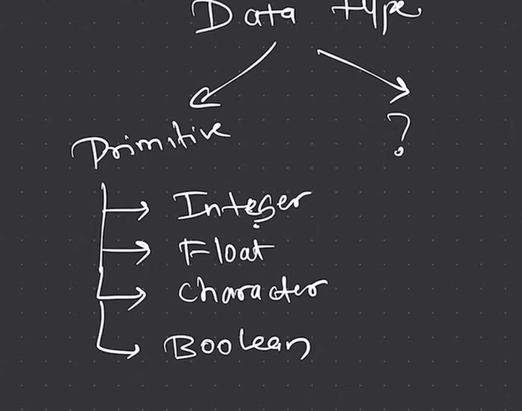
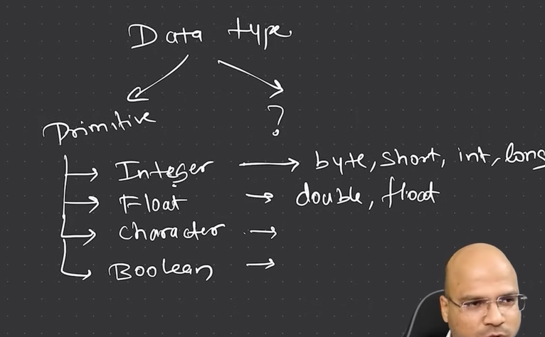
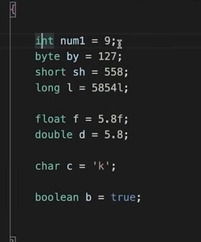
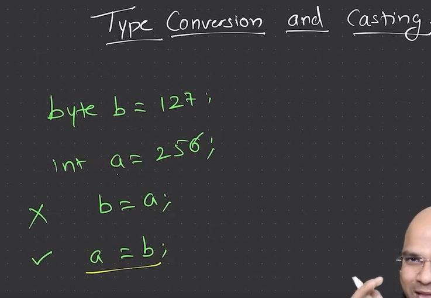
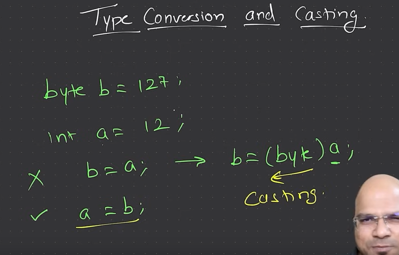
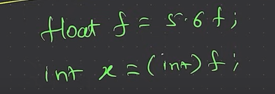

java is platform independet

machine need jvm

jvm need to build for particular os 

convert code in byte code , jvm only understand byte code 

java code - compiler - byte code - jvm

jvm starts with just one file 

that first need to have main method 

jvm need main method 

java is object oriented every thing is object

byte code have .class extension

outside jvm there is jre - jvm is part of jre jre have libs , 

jdk > jre > jvm  

temp data store in variables

strongly typed java is 

 

 

Sure, let's break down these concepts in a simple way:
1. Bit

    What is it?
    A bit is the smallest unit of data in a computer. It can be either a 0 or a 1, representing the smallest piece of information.

    Example:
    Imagine a switch that can be either ON (1) or OFF (0). That's like a single bit.

2. Byte

    What is it?
    A byte is a group of 8 bits. It's the basic unit of storage in computers and is used to represent a single character like a letter, number, or symbol.

    Example:
    Think of a byte as a small box that can hold 8 switches (bits). Each switch can be either ON (1) or OFF (0), giving you 256 (2^8) possible combinations.

    long and float need at the end l and f according 

    

    

    

    

    cant store int into byte